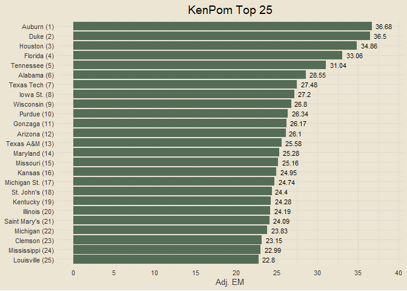

### Data Acquisition

<details>
<summary>
View Code
</summary>

``` r
get_kenpom = function() {
  url = "https://kenpom.com/"
  webpage = read_html(url)
  tbl = (webpage |> html_nodes(css = "#data-area") |> html_table())[[1]]
  
  my_cols = c("rk", "team", "conf", "w_l", "adj_em",
              "adj_o", "adj_o_rk", "adj_d", "adj_d_rk",
              "adj_t", "adj_t_rk",
              "luck", "luck_rk",
              "sos_adj_em", "sos_adj_em_rk", "sos_opp_o", "sos_opp_o_rk", "sos_opp_d", "sos_opp_d_rk",
              "ncsos_adj_em", "ncsos_adj_em_rk")
  
  df = tbl |>
    setNames(my_cols) |>
    filter(rk != "Rk" & rk != "") |>
    mutate(rk = as.integer(rk), adj_em = as.numeric(adj_em), adj_o = as.numeric(adj_o),
           adj_o_rk = as.integer(adj_o_rk), adj_d = as.numeric(adj_d), adj_d_rk = as.integer(adj_d_rk),
           adj_t = as.numeric(adj_t), adj_t_rk = as.integer(adj_t_rk), luck = as.numeric(luck),
           luck_rk = as.integer(luck_rk), sos_adj_em = as.numeric(sos_adj_em),
           sos_adj_em_rk = as.integer(sos_adj_em_rk), sos_opp_o = as.numeric(sos_opp_o),
           sos_opp_o_rk = as.integer(sos_opp_o_rk), sos_opp_d = as.numeric(sos_opp_d),
           sos_opp_d_rk = as.integer(sos_opp_d_rk), ncsos_adj_em = as.numeric(ncsos_adj_em),
           ncsos_adj_em_rk = as.integer(ncsos_adj_em_rk))
  
  return(df)
}

kp_raw = get_kenpom() |>
  mutate(team = trimws(str_remove_all(team, "\\d+")))

games_raw = cbd_torvik_game_box(year = 2024)
print("Data acquisition complete")
```

</details>

    ## [1] "Data acquisition complete"

### Matching Team Names Between Data Sources

<details>
<summary>
View Code
</summary>

``` r
kp_teams = sort(unique(kp_raw$team))

torvik_teams = games_raw |>
  count(team) |>
  filter(n >= 20) |>
  pull(team)

kp = kp_raw |>
  mutate(team = case_when(team == "N.C. State" ~ "North Carolina St.",
                          team == "Charleston" ~ "College of Charleston",
                          team == "Louisiana" ~ "Louisiana Lafayette",
                          team == "Purdue Fort Wayne" ~ "Fort Wayne",
                          team == "LIU" ~ "LIU Brooklyn",
                          team == "Saint Francis" ~ "St. Francis PA",
                          team == "Detroit Mercy" ~ "Detroit",
                          T ~ team))

if (length(intersect(kp$team, torvik_teams)) == length(torvik_teams)) {
  print("Team names matched successfully")
} else {
  print("Team names not matched")
}
```

</details>

    ## [1] "Team names matched successfully"

### Building Master Game Results Data Set

<details>
<summary>
View Code
</summary>

``` r
valid_game_ids = games_raw |>
  filter(team %in% torvik_teams) |>
  count(game_id) |>
  filter(n == 2) |>
  pull(game_id)

get_home_team = function(gid) {
  teams = games_raw |>
    filter(game_id == gid) |>
    pull(team)
  
  loc1 = str_locate(gid, teams[1])[1]
  loc2 = str_locate(gid, teams[2])[1]
  
  if (loc1 < loc2) {
    return(teams[2])
  } else {
    return(teams[1])
  }
}

get_away_team = function(gid) {
  teams = games_raw |>
    filter(game_id == gid) |>
    pull(team)
  
  loc1 = str_locate(gid, teams[1])[1]
  loc2 = str_locate(gid, teams[2])[1]
  
  if (loc1 < loc2) {
    return(teams[1])
  } else {
    return(teams[2])
  }
}

home_away_teams = data.frame(game_id = valid_game_ids) |>
  mutate(home_team = sapply(game_id, get_home_team),
         away_team = sapply(game_id, get_away_team))

team_game_pts_scored = games_raw |>
  distinct(game_id, team, pts)

game_results = home_away_teams |>
  inner_join(games_raw |>
  distinct(game_id, date), by = "game_id") |>
  select(game_id, date, home_team, away_team) |>
  inner_join(team_game_pts_scored, by = c("game_id", "home_team" = "team")) |>
  rename(home_score = pts) |>
  inner_join(team_game_pts_scored, by = c("game_id", "away_team" = "team")) |>
  rename(away_score = pts) |>
  mutate(win_team = ifelse(home_score > away_score, home_team, away_team),
         lose_team = ifelse(home_score > away_score, away_team, home_team),
         win_score = ifelse(home_score > away_score, home_score, away_score),
         lose_score = ifelse(home_score > away_score, away_score, home_score))

sprintf("%s game results retrieved successfully", nrow(game_results))
```

</details>

    ## [1] "5708 game results retrieved successfully"

### KenPom Top 25

<details>
<summary>
View Code
</summary>

``` r
better_date = function(date) {
  return(paste0(month(date, label = T, abbr = F), " ", day(date), ", ", year(date)))
}

fig_data = kp |>
  slice_max(adj_em, n = 25, with_ties = F) |>
  mutate(team = paste0(team, " (", rk, ")"))

fig_data |>
  ggplot(aes(reorder(team, adj_em), adj_em)) +
  geom_col(fill = "black") +
  geom_text(aes(label = adj_em), size = 3, hjust = -0.25) +
  coord_flip(ylim = c(0, max(fig_data$adj_em) * 1.05)) +
  scale_y_continuous(breaks = seq(0, 50, by = 5)) +
  labs(x = NULL, y = "Adj. EM",
       title = "KenPom Top 25")
```

</details>

<!-- -->

### Building Data for Modeling

<details>
<summary>
View Code
</summary>

``` r
kp_refined = kp |>
  select(-contains("rk"), -conf) |>
  separate(w_l, into = c("wins", "losses"), sep = "-", remove = T, convert = T) |>
  mutate(win_pct = wins / (wins + losses)) |>
  select(-c(wins, losses))

kp_names = names(kp_refined)

home_kp = kp_refined |>
  setNames(paste0("home_", kp_names))

away_kp = kp_refined |>
  setNames(paste0("away_", kp_names))

modeling_results = game_results |>
  transmute(home_team, away_team,
            home_win = ifelse(win_team == home_team, 1, 0)) |>
  inner_join(home_kp, by = "home_team") |>
  inner_join(away_kp, by = "away_team") |>
  select(-c(home_team, away_team)) |>
  mutate(home_win = factor(home_win))

sprintf("Modeling data: %s games, %s variables", nrow(modeling_results), ncol(modeling_results) - 1)
```

</details>

    ## [1] "Modeling data: 5708 games, 20 variables"

<details>
<summary>
View Code
</summary>

``` r
# helper function to generate modeling data for a given matchup
generate_matchup_data = function(home_team, away_team) {
  return(data.frame(home_team = home_team, away_team = away_team) |>
    inner_join(home_kp, by = "home_team") |>
    inner_join(away_kp, by = "away_team") |>
    select(-c(home_team, away_team)))
}

# generate_matchup_data(home_team = "North Carolina", away_team = "Duke")
```

</details>

### Modeling

<details>
<summary>
View Code
</summary>

``` r
set.seed(1251)
train_index = sample(nrow(modeling_results), 0.7 * nrow(modeling_results))
train_data = modeling_results[train_index, ]
test_data = modeling_results[-train_index, ]
rf_model = randomForest(home_win ~ ., data = train_data)
predictions = predict(rf_model, newdata = test_data)
accuracy = round(mean(predictions == test_data$home_win) * 100, 2)
sprintf("Random forest accuracy: %s%%", accuracy)
```

</details>

    ## [1] "Random forest accuracy: 71.04%"

<details>
<summary>
View Code
</summary>

``` r
conf_matrix = table(predictions, test_data$home_win)
precision = conf_matrix[2, 2] / sum(conf_matrix[, 2])
recall = conf_matrix[2, 2] / sum(conf_matrix[2, ])
f1_score = round(2 * precision * recall / (precision + recall) * 100, 2)
sprintf("Random forest F1: %s%%", f1_score)
```

</details>

    ## [1] "Random forest F1: 77.64%"

### Generating Game Prediction Functions

<details>
<summary>
View Code
</summary>

``` r
make_game_prediction = function(home_team, away_team) {
  game_data = generate_matchup_data(home_team = home_team, away_team = away_team)
  home_win = predict(rf_model, game_data)[[1]]
  win_probs = predict(rf_model, game_data, type = "prob")
  if (home_win == 1) {
    return(sprintf("%s def. %s (%s%%)", home_team, away_team, win_probs[2] * 100))
  } else if (home_win == 0) {
    return(sprintf("%s def. %s (%s%%)", away_team, home_team, win_probs[1] * 100))
  }
}

neutral_predict = function(home_team, away_team) {
  game_data = generate_matchup_data(home_team = home_team, away_team = away_team)
  other_data = generate_matchup_data(home_team = away_team, away_team = home_team)
  probs1 = predict(rf_model, game_data, type = "prob")[2]
  probs2 = predict(rf_model, other_data, type = "prob")[1]
  ovr = round(mean(c(probs1, probs2)) * 100, 1)
  if (ovr == 50) {
    return("Dead even")
  } else if (ovr > 50) {
    return(sprintf("%s def. %s (%s%%)", home_team, away_team, ovr))
  } else if (ovr < 50) {
    return(sprintf("%s def. %s (%s%%)", away_team, home_team, 1 - ovr))
  }
}
```

</details>

### Predicting Sweet 16

    ## [1] "Today's games"

    ## [1] "Arizona def. Clemson (65.3%)"

    ## [1] "Connecticut def. San Diego St. (63.2%)"

    ## [1] "North Carolina def. Alabama (63.7%)"

    ## [1] "Iowa St. def. Illinois (56.8%)"

    ## [1] "----------------------------------------------"

    ## [1] "Tomorrow's games"

    ## [1] "Marquette def. North Carolina St. (77.9%)"

    ## [1] "Purdue def. Gonzaga (72.6%)"

    ## [1] "Houston def. Duke (73.5%)"

    ## [1] "Tennessee def. Creighton (59%)"
